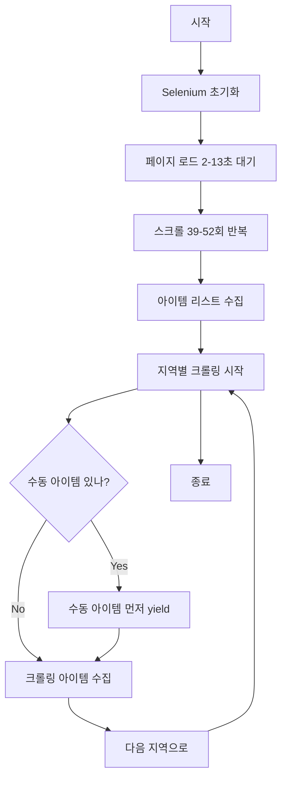

# Recru_It - 건설업 채용정보 크롤러

> 한국 건설업 일용직 채용 정보를 일다오(ildao.com)에서 자동 수집하는 Scrapy 기반 웹 크롤러

---

## 📋 목차

- [프로젝트 개요](#프로젝트-개요)
- [주요 기능](#주요-기능)
- [설치 및 실행](#설치-및-실행)
- [프로젝트 구조](#프로젝트-구조)
- [설정 가이드](#설정-가이드)
- [크롤링 동작 방식](#크롤링-동작-방식)
- [개발 가이드](#개발-가이드)
- [트러블슈팅](#트러블슈팅)

---

## 프로젝트 개요

### 기술 스택
- **Python 3.x**
- **Scrapy**: 웹 크롤링 프레임워크
- **Selenium**: JavaScript 렌더링 및 동적 페이지 처리
- **ChromeDriver**: 브라우저 자동화 (webdriver_manager로 자동 관리)

### 수집 데이터
- 제목, 근무지, 직종, 급여
- 조건(숙식제공, 4대보험, 출퇴근가능, 장기근무)
- 필요 인원, 연락처, 상세 내용, 이미지 URL

### 대상 지역 (17개)
서울, 부산, 경기, 인천, 충남, 충북, 대전, 세종, 전남, 광주, 전북, 경남, 울산, 경북, 대구, 강원, 그외

---

## 주요 기능

### 1. 자동화된 웹 스크래핑
- Selenium 기반 동적 렌더링 페이지 크롤링
- 무작위 대기 시간으로 탐지 회피
- 167개 User-Agent 로테이션
- 11개 윈도우 크기 랜덤화

### 2. 지역별 크롤링
- 17개 지역별 설정 관리 (`settings.py`)
- 지역별 아이템 수 제한 (경기/인천/충북: 450개)
- 지역별 대기 시간 개별 설정

### 3. 수동 채용정보 추가
- 지역별로 채용정보 수동 추가 가능
- JSON 결과에서 각 지역의 **맨 앞**에 배치
- 설정 파일(`settings.py`)에서 간편 관리

### 4. 데이터 정제 및 필터링
- 100+ 개 정규식 기반 텍스트 정제
- 오타 자동 수정
- 중복 제거 (제목/연락처 기반)
- 저품질 공고 필터링

---

## 설치 및 실행

### 1. 의존성 설치

```bash
pip install -r requirements.txt
```

**requirements.txt:**
```
webdriver_manager
scrapy
selenium
```

### 2. 크롤러 실행

```bash
# 프로젝트 디렉토리로 이동
cd recru_it

# 크롤러 실행
scrapy crawl recru_it
```

### 3. 결과 확인

크롤링 완료 후 `recru_result.json` 파일이 생성됩니다.

```bash
# JSON 파일 확인
cat recru_result.json | python3 -m json.tool | head -50
```

---

## 프로젝트 구조

```
Recru_It_JSON/
├── recru_it/                           # Scrapy 프로젝트 루트
│   ├── scrapy.cfg                     # Scrapy 설정 파일
│   └── recru_it/                      # 메인 패키지
│       ├── __init__.py
│       ├── items.py                   # 데이터 모델 (11개 필드)
│       ├── settings.py                # ⭐ 크롤링 설정 (중요)
│       ├── pipelines.py               # 데이터 필터링 & 중복 제거
│       ├── middlewares.py             # 미들웨어
│       └── spiders/                   # 스파이더 모듈
│           ├── __init__.py
│           ├── constants.py           # 167개 UA, 윈도우 크기, 언어
│           └── recru_it.py           # ⭐ 메인 크롤러
├── config.json                        # 크롤링 결과 데이터
├── jobInfo.json                       # 크롤링 결과 데이터
├── requirements.txt                   # 프로젝트 의존성
├── CLAUDE.md                          # 이 파일
└── README.md                          # 프로젝트 설명 (있다면)
```

### 주요 파일 설명

| 파일 | 역할 | 라인 수 |
|------|------|---------|
| `settings.py` | 크롤링 설정 (지역, 대기시간, 수동 아이템) | ~300줄 |
| `recru_it.py` | 메인 크롤러 로직 | ~380줄 |
| `constants.py` | User-Agent, 윈도우 크기, 언어 상수 | ~180줄 |
| `items.py` | 데이터 모델 정의 | ~20줄 |
| `pipelines.py` | 데이터 필터링 및 중복 제거 | ~100줄 |

---

## 설정 가이드

### 1. 지역별 크롤링 설정 (`settings.py`)

**위치**: `recru_it/recru_it/settings.py` (101~246번 라인)

```python
CRAWL_CONFIG = {
    'scroll_range': (39, 52),           # 스크롤 반복 횟수
    'initial_sleep': (2, 13),           # 초기 페이지 로드 대기 시간

    'regions': [
        {
            'name': '서울',
            'keywords': ['서울'],
            'exclude_keywords': [],
            'item_limit': None,         # None = 제한 없음
            'sleep_before': (2, 5),     # 지역 크롤링 전 대기 (초)
            'sleep_between': (1, 6),    # 각 아이템 클릭 전 대기 (초)
        },
        # ... 17개 지역 설정
    ]
}
```

#### 설정 항목 설명

| 항목 | 설명 | 예시 |
|------|------|------|
| `name` | 지역 이름 | `'서울'`, `'부산'` |
| `keywords` | 지역 필터링 키워드 | `['서울']`, `['경기']` |
| `exclude_keywords` | 제외 키워드 | `['부산']` (대구 검색 시 "부산 해운대구" 제외) |
| `item_limit` | 아이템 수 제한 | `450` (경기/인천/충북), `None` (제한 없음) |
| `sleep_before` | 지역 크롤링 전 대기 | `(2, 5)` = 2~5초 랜덤 |
| `sleep_between` | 아이템 클릭 전 대기 | `(1, 6)` = 1~6초 랜덤 |

#### 새로운 지역 추가 방법

```python
{
    'name': '제주',
    'keywords': ['제주'],
    'exclude_keywords': [],
    'item_limit': None,
    'sleep_before': (3, 7),
    'sleep_between': (1, 4),
},
```

### 2. 수동 채용정보 추가 (`settings.py`)

**위치**: `recru_it/recru_it/settings.py` (248~300번 라인)

```python
MANUAL_JOBS_BY_REGION = {
    '서울': [
        # 서울 지역 수동 아이템
    ],
    '부산': [
        {
            'title': '부산 양정 롯데 설비이중관 기공',
            'site': '부산 부산진구',
            'type': '설비',
            'pay': '일급 20만원',
            'etc1': '4대보험',
            'etc2': '',
            'etc3': '',
            'numpeople': '1명',
            'phone': '010-1234-5678',
            'detail': '양정 롯데건설\n설비이중관 기공 작업자 구합니다.',
            'imageURL': '',
            'time': '',
            'sponsored': ''
        },
    ],
    # ... 17개 지역
}
```

#### 필수 필드 (11개)

| 필드 | 설명 | 예시 |
|------|------|------|
| `title` | 공고 제목 | `'부산 해운대 전기 조공 모집'` |
| `site` | 근무지 | `'부산 해운대구'` |
| `type` | 직종 | `'전기'`, `'비계/동바리'` |
| `pay` | 급여 | `'일급 17만원 이상'` |
| `etc1` | 조건1 | `'숙식제공'`, `'4대보험'` |
| `etc2` | 조건2 | `'출퇴근가능'`, `'장기근무'` |
| `etc3` | 조건3 | `''` (빈 문자열 가능) |
| `numpeople` | 필요 인원 | `'2명'`, `'상시'` |
| `phone` | 연락처 | `'010-1234-5678'` |
| `detail` | 상세 내용 | `'현장 주소:\n...'` |
| `imageURL` | 이미지 URL | `''` (대부분 빈값) |
| `time` | 등록 시간 | `''` (현재 미사용) |
| `sponsored` | 광고 여부 | `''` (현재 미사용) |

#### 수동 아이템 추가 예시

```python
'경기': [
    {
        'title': '평택 고덕 전기 포설 조공 모집',
        'site': '경기 평택시 고덕면',
        'type': '전기',
        'pay': '일급 18만원 이상',
        'etc1': '4대보험',
        'etc2': '출퇴근가능',
        'etc3': '',
        'numpeople': '3명',
        'phone': '010-2222-3333',
        'detail': '평택 고덕 아파트 신축 현장\n전기 포설 조공 경력 2년 이상\n출퇴근 가능자 우대',
        'imageURL': '',
        'time': '',
        'sponsored': ''
    },
],
```

### 3. 탐지 회피 설정 (`constants.py`)

**위치**: `recru_it/recru_it/spiders/constants.py`

```python
USER_AGENTS = [
    'Mozilla/5.0 (Windows NT 10.0; Win64; x64) ...',
    # ... 167개
]

WINDOW_SIZES = [
    'window-size=3440x1440',
    # ... 11개
]

LANG = [
    'lang=ko_KR',
    # ... 7개
]
```

---

## 크롤링 동작 방식

### 1. 전체 흐름



### 2. 지역별 크롤링 순서

1. **서울** → 2. **부산** → 3. **경기** (450개 제한) → 4. **인천** (450개 제한) → 5. **충남** → 6. **충북** (450개 제한) → 7. **대전** → 8. **세종** → 9. **전남** → 10. **광주** → 11. **전북** → 12. **경남** → 13. **울산** → 14. **경북** → 15. **대구** → 16. **강원** → 17. **그외**

### 3. 각 지역 크롤링 프로세스

```python
for region_config in CRAWL_CONFIG['regions']:
    # 1. 수동 아이템 먼저 추가 (있다면)
    if region_name in MANUAL_JOBS_BY_REGION:
        for job_data in MANUAL_JOBS_BY_REGION[region_name]:
            yield job_item  # ⭐ 지역별 맨 앞에 배치

    # 2. 크롤링 전 대기
    time.sleep(random.randint(*sleep_before))

    # 3. 크롤링 아이템 수집
    for index, job_item in enumerate(ildao_items):
        # 필터링 & 상세 정보 수집
        yield job_item
```

### 4. 데이터 처리 파이프라인

```
크롤링 → Recru_It_Pipeline (필터링) → DuplicatesPipeline (중복 제거) → JSON 파일
```

**필터링 규칙** (`pipelines.py`):
- 일급/월급 10~13만원 제거
- "일다오" 포함 제거
- 상세 내용 27자 미만 제거
- 제목 6자 미만 제거
- 특정 전화번호 제거 (6개)

**중복 제거**:
- 제목 기반 중복 검사
- 연락처 기반 중복 검사

---

## 개발 가이드

### 코드 구조 (리팩토링 완료)

#### Before (리팩토링 전)
```python
# 840줄, 465줄의 중복 코드
# 서울 전체
for index, job_item in enumerate(ildao_items):
    if index >= first_no_simple and site_text_items[index].find('서울') >= 0:
        # ... 27줄 반복 코드

# 부산 전체
for index, job_item in enumerate(ildao_items):
    if index >= first_no_simple and site_text_items[index].find('부산') >= 0:
        # ... 27줄 반복 코드

# ... 17개 지역 반복
```

#### After (리팩토링 후)
```python
# 375줄, 중복 코드 0줄
for region_config in CRAWL_CONFIG['regions']:
    yield from self.process_region(...)  # 공통 로직
```

### 주요 메서드

#### 1. `parse(self, response)` - 메인 크롤링 로직
- Selenium으로 페이지 로드
- 스크롤링으로 아이템 수집
- 지역별 크롤링 실행

#### 2. `process_region(...)` - 지역별 크롤링
- 수동 아이템 먼저 yield
- 크롤링 아이템 수집 및 yield
- 지역별 설정 적용

#### 3. `_matches_region(...)` - 지역 필터링
- 키워드 매칭
- 제외 키워드 체크
- Boolean 반환

#### 4. `get_job_detail()` - 상세 정보 추출
- CSS 선택자로 데이터 추출
- 100+ 개 정규식으로 텍스트 정제
- 11개 필드 반환

### 새로운 기능 추가 가이드

#### 1. 새로운 지역 추가
```python
# settings.py의 CRAWL_CONFIG['regions']에 추가
{
    'name': '새지역',
    'keywords': ['새지역'],
    'exclude_keywords': [],
    'item_limit': None,
    'sleep_before': (3, 7),
    'sleep_between': (1, 4),
}

# MANUAL_JOBS_BY_REGION에도 추가
'새지역': [],
```

#### 2. 필터링 규칙 추가
```python
# pipelines.py의 Recru_It_Pipeline.process_item()에 추가
if re.search('새로운 필터링 패턴', item['title']):
    raise DropItem("필터링 사유")
```

#### 3. 텍스트 정제 규칙 추가
```python
# recru_it.py의 get_job_detail()에 추가
title = re.sub('오타', '수정', title)
detail = re.sub('불필요한문자', '', detail)
```

---

## 트러블슈팅

### 1. ChromeDriver 오류

**증상**:
```
selenium.common.exceptions.WebDriverException: 'chromedriver' executable needs to be in PATH
```

**해결**:
```bash
# webdriver_manager가 자동으로 설치하므로 일반적으로 발생하지 않음
# 수동 설치가 필요한 경우:
brew install chromedriver  # macOS
```

### 2. 타임아웃 오류

**증상**:
```
TimeoutException: Message: timeout
```

**해결**:
- `settings.py`에서 `sleep_before`, `sleep_between` 값 증가
- 네트워크 상태 확인

### 3. 빈 결과 파일

**증상**:
`recru_result.json`이 비어있거나 아이템이 적음

**해결**:
1. `first_no_simple` 값 확인 (콘솔 출력)
2. 지역 키워드 확인 (`keywords` 설정)
3. 필터링 규칙 확인 (`pipelines.py`)

### 4. 중복 아이템

**증상**:
동일한 공고가 여러 번 나타남

**해결**:
- `DuplicatesPipeline`이 활성화되어 있는지 확인 (`settings.py`)
- 제목/연락처 정규화 로직 확인

### 5. 수동 아이템이 추가되지 않음

**증상**:
`MANUAL_JOBS_BY_REGION`에 추가했는데 JSON에 없음

**해결**:
1. 주석(`#`) 제거 확인
2. 지역 이름 정확히 일치하는지 확인 (`'서울'` vs `'Seoul'`)
3. 11개 필드 모두 포함했는지 확인

### 6. Import 오류

**증상**:
```
ImportError: cannot import name 'MANUAL_JOBS_BY_REGION' from 'recru_it.settings'
```

**해결**:
```bash
# settings.py 저장 확인
# 프로젝트 디렉토리 확인
cd recru_it
pwd  # /Users/jay/Documents/Recru_It_JSON/recru_it 확인
```

---

## 테스트 및 검증

### 1. 크롤링 테스트

```bash
cd recru_it
scrapy crawl recru_it
```

**성공 시 출력**:
```
...
총 아이템 수 : [XXX]
first_no_simple : [YY]
# # # # # # # # # # # # # # # # # # # # # #   정상종료   # # # # # # # # # # # # # # # # # # # # # #
```

### 2. 결과 검증

```bash
# 아이템 개수 확인
cat recru_result.json | python3 -m json.tool | grep '"title"' | wc -l

# 지역별 분포 확인
cat recru_result.json | python3 -m json.tool | grep '"site"' | sort | uniq -c

# 수동 아이템 확인 (부산 예시)
cat recru_result.json | python3 -m json.tool | grep -A 5 '"부산 양정 롯데"'
```

### 3. 데이터 품질 확인

```bash
# 필수 필드 누락 확인
cat recru_result.json | python3 -m json.tool | grep '"title": ""'
cat recru_result.json | python3 -m json.tool | grep '"phone": ""'

# 중복 확인 (제목 기준)
cat recru_result.json | python3 -m json.tool | grep '"title"' | sort | uniq -d
```

---

## 성능 및 통계

### 크롤링 속도
- 초기 로드: 2~13초
- 스크롤링: 약 3~5분 (39~52회 × 3~5초)
- 지역별 크롤링: 약 10~30분 (지역별 대기 시간 차이)
- **총 소요 시간**: 약 15~45분

### 수집 데이터 규모
- **서울**: 약 200~500개
- **부산**: 약 100~300개
- **경기**: 최대 450개 (제한)
- **인천**: 최대 450개 (제한)
- **충북**: 최대 450개 (제한)
- **기타 지역**: 약 50~200개
- **총합**: 약 1,500~3,000개

### 코드 메트릭스 (리팩토링 후)
- **코드 줄 수**: 375줄 (리팩토링 전: 840줄)
- **중복 코드**: 0줄 (리팩토링 전: 465줄)
- **순환 복잡도**: 낮음 (메서드 분리)
- **유지보수성**: 높음 (설정 외부화)

---

## 커밋 히스토리

```
bf3a80f feat: 지역별 수동 채용정보 추가 기능 구현
1ac2c71 refactor: 코드 중복 제거 및 설정 외부화
c5c0369 refactor: constants 모듈 분리 및 import 구조 개선
77b7126 Recru_It
41c3f2b 경기, 인천, 충북 리스트 450개 까지만 적용
```

---

## 라이선스

이 프로젝트는 개인 프로젝트입니다.

---

## 연락처

프로젝트 관련 문의: [GitHub Issues](https://github.com/사용자이름/Recru_It_JSON/issues)

---

**마지막 업데이트**: 2025-10-28
**버전**: 2.0.0 (리팩토링 완료)
